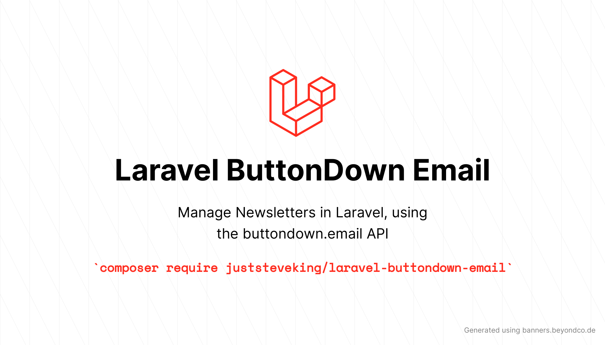

# Laravel Button Down Email

<p align="center">



</p>
∏
[](https://packagist.org/packages/juststeveking/laravel-buttondown-email)

[](https://packagist.org/packages/juststeveking/laravel-buttondown-email)


A Laravel wrapper for working with the [Buttondown Email](https://buttondown.email/) API, allowing you to manage subscribers with ease. If you would like to read the API documentation for yourself [you can find it here](https://api.buttondown.email/v1/schema#).

So far I have only integrated the Subscribers endpoints, as it is all I needed right now. Feel free to PR anything else!

## Installation

You can install the package via composer:

```bash
composer require juststeveking/laravel-buttondown-email
```

You can publish the config file with:
```bash
php artisan vendor:publish --provider="JustSteveKing\Laravel\ButtonDownEmail\ButtonDownServiceProvider" --tag="config"
```

This is the contents of the published config file:

```php
return [
    'api' => [
        'key' => env('BUTTONDOWN_KEY'),
        'url' => env('BUTTONDOWN_URL', 'https://api.buttondown.email/v1'),
        'timeout' => env('BUTTONDOWN_TIMEOUT', 10),
        'retry' => [
            'times' => env('BUTTONDOWN_RETRY_TIMES', null),
            'milliseconds' => env('BUTTONDOWN_RETRY_MILLISECONDS', null),
        ],
    ]
];
```

## Usage

This library is aimed to be easy to use, and slots into Laravel with no issues.

The package will install a Service Provider for you, meaning that all you need to do is resolve the `Client` from the container, and start using it.

Please bear in mind as this is a Laravel package I have leveraged the Laravel Validator to validate requests before sending them to the API. This will throw a basic Exception if it fails. Subscription rules are as follows:

```php
$rules = [
    'email' => ['required', 'email:rfc,dns'],
    'metadata' => ['nullable', 'array'],
    'notes' => ['nullable', 'string'],
    'referrer_url' => ['nullable', 'string', 'max:500'],
    'tags' => ['nullable', 'array'],
];
```


### List all Subscribers

```php
use JustSteveKing\Laravel\ButtonDownEmail\Client;

class SubscribersController extends Controler
{
    public function __construct(
        protected Client $service,
    ) {}

    public function __invoke(Request $request)
    {
        // This will return a Collection of subscribers
        $subscribers = $this->service->subscribers()->get();
    }
}
```

### Create a new Subscriber

```php
use JustSteveKing\Laravel\ButtonDownEmail\Client;

class SubscribeController extends Controler
{
    public function __construct(
        protected Client $service,
    ) {}

    public function __invoke(Request $request)
    {
        $subscriber = $this->service->subscribers()->create([
            'email' => $request->get('email'), // required
            'metadata' => $request->get('metadata', null), // optional
            'notes' => $request->get('notes', null), // optional
            'referrer_url' => $request->get('referrer_url', null), // optional
            'tags' => $request->get('tags', null), // optional
        ]);
    }
}
```

### Delete a Subscriber

```php
use JustSteveKing\Laravel\ButtonDownEmail\Client;

class DeleteSubscriberController extends Controler
{
    public function __construct(
        protected Client $service,
    ) {}

    public function __invoke(Request $request)
    {
        // This will return true if successful, otherwise throw an exception
        $deleted = $this->service->subscribers()->delete(
            id: $request->get('id'),
        );
    }
}
```

### Retrieve a Subscriber

```php
use JustSteveKing\Laravel\ButtonDownEmail\Client;

class FetchSubscriberController extends Controler
{
    public function __construct(
        protected Client $service,
    ) {}

    public function __invoke(Request $request)
    {
        $subscriber = $this->service->subscribers()->find(
            id: $request->get('id'),
        );
    }
}
```

### Update a Subscriber

```php
use JustSteveKing\Laravel\ButtonDownEmail\Client;

class UpdateSubscriberController extends Controler
{
    public function __construct(
        protected Client $service,
    ) {}

    public function __invoke(Request $request)
    {
        $subscriber = $this->service->subscribers()->update(
            attributes: [
                'email' => $request->get('email'), // This is required for creating and updating
                'notes' => 'Here is a note from my controller',
            ],
            id: $request->get('id'),
        );
    }
}
```

### List all Unsubscribers

```php
use JustSteveKing\Laravel\ButtonDownEmail\Client;

class UnsubscribersController extends Controler
{
    public function __construct(
        protected Client $service,
    ) {}

    public function __invoke(Request $request)
    {
        // This will return a Collection of unsubscribers
        $subscribers = $this->service->unsubscribers()->get();
    }
}
```

### Retrieve an unsubscriber

```php
use JustSteveKing\Laravel\ButtonDownEmail\Client;

class FetchUnsubscriberController extends Controler
{
    public function __construct(
        protected Client $service,
    ) {}

    public function __invoke(Request $request)
    {
        $subscriber = $this->service->unsubscribers()->find(
            id: $request->get('id'),
        );
    }
}
```


## Testing

To understand how to use this part please follow the Laravel documentation for [Testing the Http Client](https://laravel.com/docs/8.x/http-client#testing)


Run the unit tests:

``` bash
./vendor/bin/testbench package:test
```

## Contributing

Please see [CONTRIBUTING](.github/CONTRIBUTING.md) for details.

## Security

If you discover any security related issues, please email juststevemcd@gmail.com instead of using the issue tracker.

## Credits

- [Steve McDougall](https://github.com/JustSteveKing)
- [All Contributors](../../contributors)

## License

The MIT License (MIT). Please see [License File](LICENSE.md) for more information.
